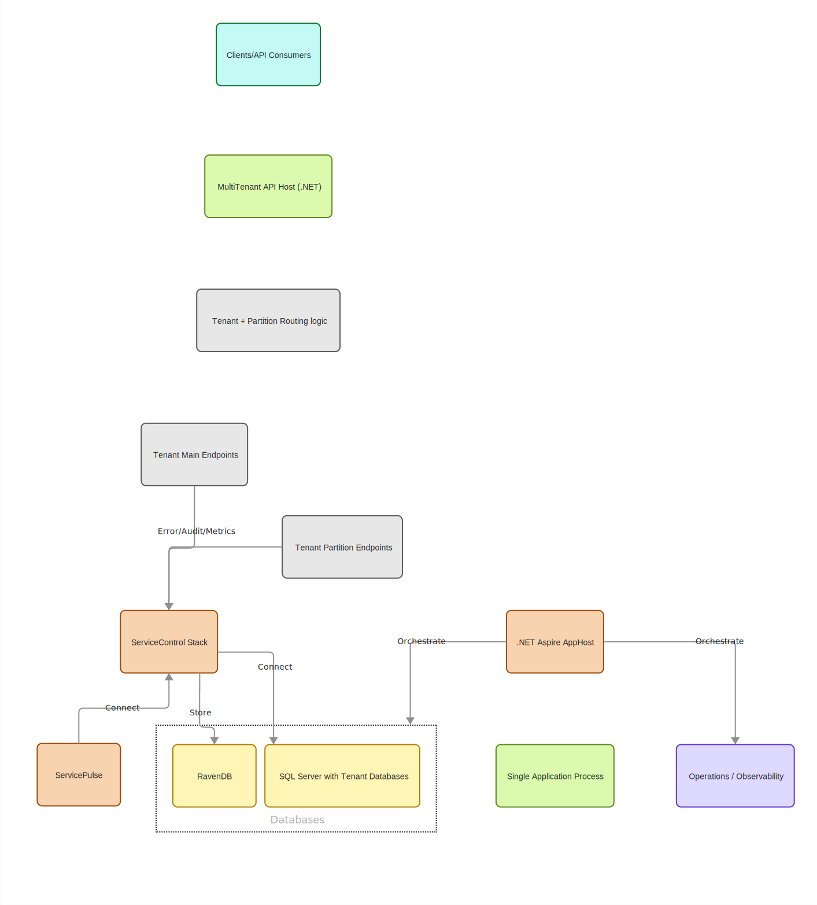
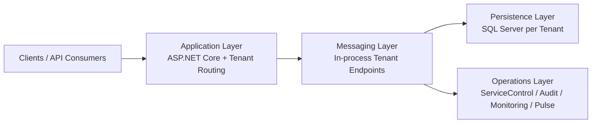
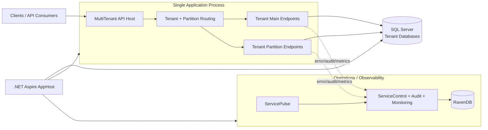
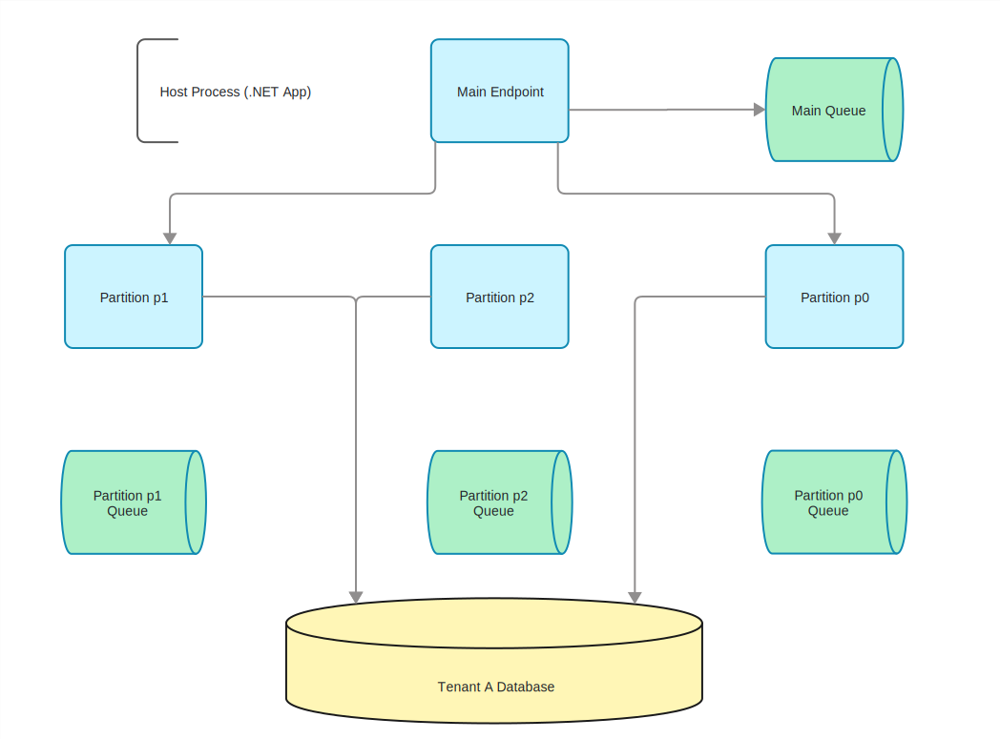
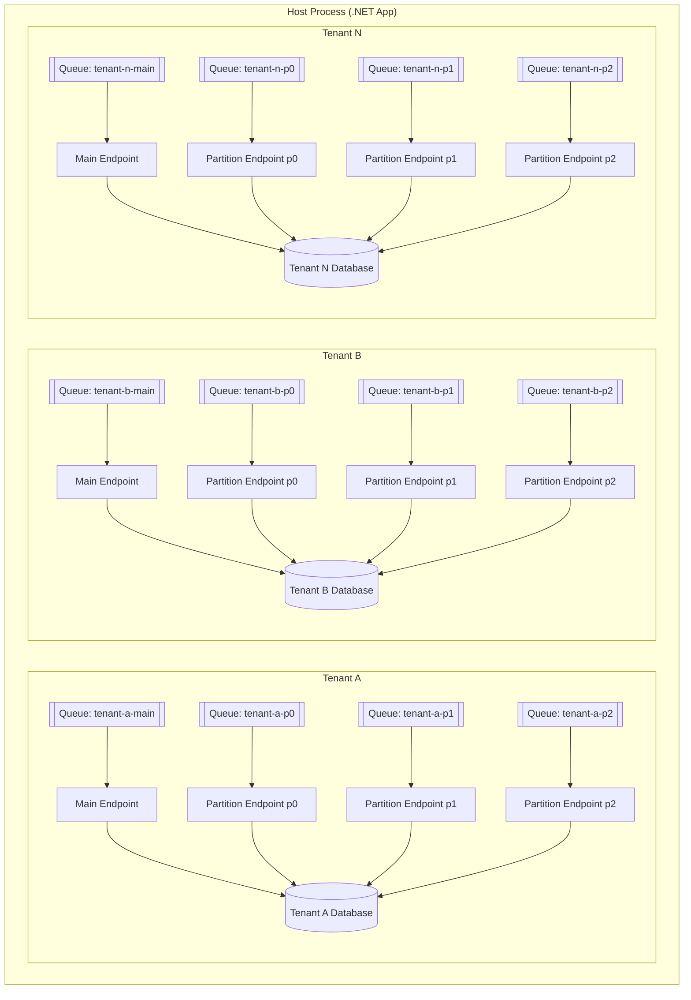

# Multi-tenant NServiceBus PoC (.NET 10)

Single ASP.NET Core project hosting multiple NServiceBus endpoints in one process.

## What it demonstrates

- Tenant-specific main endpoints for bulk ingestion.
- Tenant-specific partition endpoints (`p0`, `p1`, `p2`) for deterministic business-id routing.
- Database-per-tenant (`NsbPoc_<tenant>` by default).
- Schema-per-partition (`p0`, `p1`, `p2`) plus `dbo` for tenant main endpoint.
- `AddNServiceBusEndpoint` multi-host setup with endpoint identifiers.
- Minimal API sending via the tenant-keyed `IMessageSession`.
- Console logging with scopes and endpoint-based colors.
- EF Core auto-creates each tenant database and partition schemas on startup.
- OpenAPI document in development at `/openapi/v1.json`.
- Swagger UI in development at `/swagger`.

## Architecture diagrams

### High-level architecture

The PoC runs as a single host process. The API routes requests by tenant and partition into in-process NServiceBus endpoints. Endpoints persist into tenant-isolated SQL databases and report operational telemetry to the ServiceControl stack.





### System context (host, data, and operations)

This view shows how the API host, routing, SQL data layer, ServiceControl stack, and Aspire AppHost orchestration fit together.



### Host with tenant endpoint topology

Each tenant has a main endpoint plus partition endpoints. Every endpoint has its own queue and writes to the tenant's database.





## Configuration

Tenants and SQL transport are configured in `MultiTenantPoc/appsettings.json` under `Poc`.

## Run SQL Edge (Docker)

```bash
docker run --name sql-edge -e "ACCEPT_EULA=1" -e "MSSQL_SA_PASSWORD=Your_password123" -p 1433:1433 -d mcr.microsoft.com/azure-sql-edge:latest
```

## Run

```bash
dotnet run --project MultiTenantPoc/MultiTenantPoc.csproj
```

Then open `http://localhost:5122/swagger`.

## Run with .NET Aspire

```bash
dotnet run --project MultiTenantPoc.AppHost/MultiTenantPoc.AppHost.csproj
```

This starts SQL Server and the `MultiTenantPoc` app through the Aspire AppHost.
The AppHost uses the same SQL Edge image as the manual Docker command (`mcr.microsoft.com/azure-sql-edge:latest`).

## Test endpoints

Bulk to tenant main endpoint:

```bash
curl -X POST http://localhost:5122/api/tenant-a/bulk \
  -H "Content-Type: application/json" \
  -d '{"businessId":"import-batch-042","payload":"bulk-import"}'
```

Partitioned command to tenant partition endpoint:

```bash
curl -X POST http://localhost:5122/api/tenant-a/business \
  -H "Content-Type: application/json" \
  -d '{"businessId":"invoice-9917","payload":"process-order"}'
```

Check which partition/endpoint a business id maps to:

```bash
curl http://localhost:5122/api/tenant-a/partition/order-2026-00042
```
